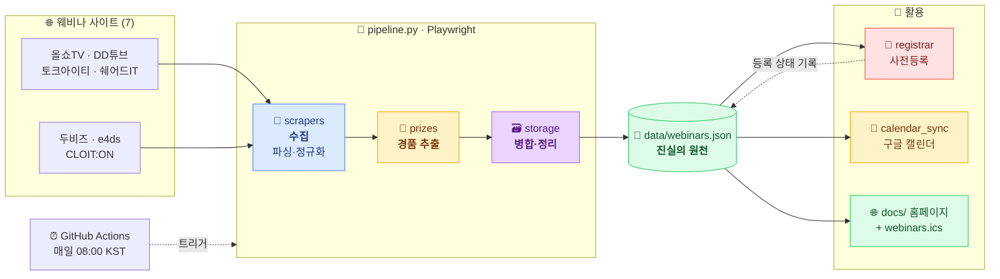
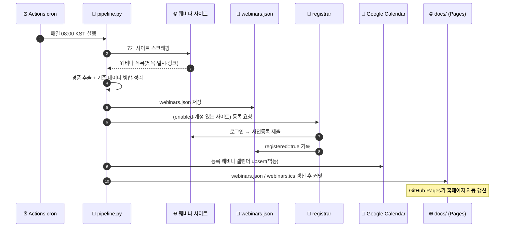

# webinar-auto-registration

국내 IT 웨비나를 **매일 자동으로 수집·등록**하고, **구글 캘린더에 추가**하며,
**월별 일정 + 경품 정보 홈페이지**(GitHub Pages)로 공개하는 프로젝트입니다.

---

## 🧩 한눈에 보기

7개 웨비나 사이트에서 일정을 **수집**하고, 하나의 데이터(`data/webinars.json`)로 **정리**한 뒤,
**등록·캘린더·홈페이지** 세 갈래로 **활용**하는 단일 파이프라인입니다. 매일 GitHub Actions가 돌립니다.



| 단계 | 모듈 | 한 줄 설명 |
|---|---|---|
| 📡 **수집** | [`scrapers/`](src/webinar/scrapers) | 7개 사이트에서 제목·일시·링크·썸네일 파싱 (봇 차단/JS는 Playwright로) |
| 🎁 **경품 추출** | [`prizes.py`](src/webinar/prizes.py) | 설문/질문/상담/참석 경품 키워드 추출 + 수동 오버라이드 병합 |
| 🗃️ **정리** | [`storage.py`](src/webinar/storage.py) | 기존 데이터와 병합(등록 상태·경품 보존), 60일 지난 항목 정리 |
| 📝 **등록** | [`registrar.py`](src/webinar/registrar.py) | (활성 사이트) 로그인 후 사전등록, 멱등 |
| 📅 **캘린더** | [`calendar_sync.py`](src/webinar/calendar_sync.py) | 구글 캘린더 upsert(중복 없음) + [`ics_export.py`](src/webinar/ics_export.py) 백업 |
| 🌐 **공개** | [`docs/`](docs) | 월별 달력/목록·필터·경품·구글캘린더 링크 홈페이지 (GitHub Pages) |
| ⏰ **자동화** | [`daily.yml`](.github/workflows/daily.yml) | 매일 08:00 KST cron으로 위 전 과정 실행·커밋 |

---

## 대상 사이트

| 키 | 이름 | 주소 | 스크래퍼 상태 |
|---|---|---|---|
| `allshowtv` | 올쇼TV | https://www.allshowtv.com | ✅ 실서비스 검증됨 |
| `ddtube` | DD튜브 | https://www.ddtube.co.kr | ✅ 실서비스 검증됨(상세페이지 보강) |
| `talkit` | 토크아이티 | https://talkit.tv | ✅ 실서비스 검증됨 |
| `sharedit` | 쉐어드IT | https://www.sharedit.co.kr | ✅ 실서비스 검증됨(제목 [MMDD] 코드 활용) |
| `dubiz` | 두비즈 | https://dubiz.co.kr | 🟡 코드 작성 완료, 라이브 미검증(사내 프록시 차단) |
| `e4ds` | e4ds | https://www.e4ds.com/webinar.asp | ⚙️ 로그인 필요 |
| `cloit` | CLOIT:ON | https://webinar.cloit.com | ⚙️ SPA, 현재 세션 없음 |

> ✅ 4개 사이트는 실제 사이트에서 정상 수집을 확인했습니다.
> 🟡 두비즈는 관찰된 구조(`/onoffmix/` → `/Event/NNN`)로 스크래퍼를 작성했으나
> **사내 보안 프록시가 dubiz.co.kr을 차단**해 개발 환경에서 라이브 검증은 못 했습니다
> — GitHub Actions(사외망)에서는 접근 가능하므로 첫 실행 후 확인하세요.
> ⚙️ e4ds는 로그인, CLOIT:ON은 현재 대기 세션이 없어 셀렉터 검증이 보류 상태입니다.
> 셀렉터가 안 맞으면 해당 사이트는 **빈 결과**를 내도록 설계돼 있어(날짜 파싱 실패 시 스킵)
> 잘못된 데이터가 올라가지 않습니다.

## 동작 흐름 (Operation Flow)

매일 1회, GitHub Actions가 아래 순서로 실행합니다. 각 단계는 독립적으로 실패를 흡수하므로
한 사이트/한 단계가 실패해도 나머지는 계속 진행됩니다.



1. **수집** — `pipeline.py`가 7개 사이트를 스크래핑하고 경품을 추출합니다.
2. **정리** — 기존 `data/webinars.json`과 병합(등록 상태·수동 경품 보존), 60일 지난 항목 정리.
3. **등록** — 계정이 있고 `register.enabled: true`인 사이트에 로그인 후 사전등록(멱등).
4. **캘린더** — 등록 웨비나를 구글 캘린더에 upsert하고 `webinars.ics` 백업 피드 생성.
5. **공개** — `docs/`의 데이터를 갱신·커밋 → GitHub Pages 홈페이지 자동 반영.

> 홈페이지(`docs/`)는 `webinars.json`을 읽어 **월별 달력 / 목록** 뷰, **출처·경품 필터**,
> **경품 상세**, **구글 캘린더 추가 링크**를 제공합니다.

## 요구사항

- **Python 3.11+** (CI는 3.11 사용, 로컬 3.12 검증)
- **Playwright Chromium** — `python -m playwright install chromium`
  (리눅스에서 시스템 라이브러리가 없으면 `--with-deps` 필요, sudo 요구)
- 의존성은 [requirements.txt](requirements.txt)에 **버전 고정**되어 재현 가능

## 로컬 실행 (재현 절차)

```bash
# 1) 클론
git clone https://github.com/leemgs/webinar-auto-registration.git
cd webinar-auto-registration

# 2) 가상환경 + 의존성 (버전 고정)
python -m venv .venv && source .venv/bin/activate
pip install -r requirements.txt
python -m playwright install chromium      # 필요시: --with-deps

# 3) 소스 경로 (pytest.ini에도 pythonpath=src 설정됨)
export PYTHONPATH=src

# 4) 테스트 (오프라인, 브라우저 불필요)
pytest                                      # 14 tests

# 5) 공개 일정 스크래핑 + data/·docs/ 생성
python -m webinar.pipeline -v
python -m webinar.pipeline --site ddtube --site talkit -v   # 특정 사이트만

# 6) 등록 플로우 시뮬레이션 (실제 제출 안 함)
python -m webinar.registrar --dry-run --site ddtube -v

# 7) 홈페이지 미리보기 → http://localhost:8000
python -m http.server -d docs 8000
```

> `data/webinars.json`은 **커밋되는 결과물**(진실의 원천)입니다. `pipeline`은 기존
> 데이터와 **병합**하고(등록 상태·수동 경품 보존), 60일 지난 과거 웨비나는 정리합니다.

## 구글 캘린더 설정 (OAuth 리프레시 토큰) — 따라하기

> 링크를 클릭해 순서대로 진행하면 됩니다. 소요 5~10분. **한 번만** 하면 됩니다.

### 1단계 — Google Cloud 프로젝트 만들기
- 👉 <https://console.cloud.google.com/projectcreate> 접속 → 이름 예: `webinar-calendar` → **만들기**.
- 만든 프로젝트가 상단에 선택돼 있는지 확인.

### 2단계 — Google Calendar API 활성화
- 👉 <https://console.cloud.google.com/apis/library/calendar-json.googleapis.com> 접속 → **사용(Enable)** 클릭.

### 3단계 — OAuth 동의 화면 구성
- 👉 <https://console.cloud.google.com/apis/credentials/consent> 접속.
- User Type: **External(외부)** 선택 → 만들기.
- 앱 이름/사용자 지원 이메일/개발자 연락처만 채우고 저장하며 진행.
- **Test users(테스트 사용자)** 에 **본인 Gmail 주소 추가**.
- ⚠️ **중요**: 게시 상태가 **Testing** 이면 리프레시 토큰이 **7일 후 만료**됩니다.
  계속 쓰려면 동의 화면에서 **"앱 게시(Publish app / 프로덕션으로 전환)"** 를 눌러
  `In production` 상태로 두세요(개인 사용은 미인증 경고만 뜨고 그대로 사용 가능).

### 4단계 — OAuth 클라이언트 ID 발급 (데스크톱 앱)
- 👉 <https://console.cloud.google.com/apis/credentials> 접속.
- **+ 사용자 인증 정보 만들기 → OAuth 클라이언트 ID** → 애플리케이션 유형 **데스크톱 앱** → 만들기.
- 표시되는 **클라이언트 ID** 와 **클라이언트 보안 비밀번호** 를 복사 → 각각
  `GOOGLE_CLIENT_ID`, `GOOGLE_CLIENT_SECRET`.

### 5단계 — 리프레시 토큰 발급 (로컬에서 1회)
```bash
export PYTHONPATH=src
export GOOGLE_CLIENT_ID="<4단계 클라이언트 ID>"
export GOOGLE_CLIENT_SECRET="<4단계 보안 비밀번호>"
python scripts/get_google_token.py     # 브라우저가 열리며 동의 → 토큰 출력
```
출력된 `GOOGLE_REFRESH_TOKEN=...` 값을 복사합니다.

### 6단계 — 대상 캘린더 ID 확인 (`GOOGLE_CALENDAR_ID`)
- 기본 개인 캘린더면 그냥 `primary` 를 쓰면 됩니다.
- 특정 캘린더에 넣으려면 👉 <https://calendar.google.com/calendar/u/0/r/settings> →
  왼쪽에서 캘린더 선택 → **"캘린더 통합"** 섹션의 **캘린더 ID**(예: `abcd...@group.calendar.google.com`) 복사.

> 인증 설정이 번거로우면 캘린더 동기화를 건너뛰고, 게시된 `webinars.ics` 를
> 구글 캘린더 **"기타 캘린더 → URL로 추가"** 에 붙여 구독해도 됩니다:
> `https://leemgs.github.io/webinar-auto-registration/webinars.ics`

## GitHub Secrets 등록 — 따라하기

리포지토리 시크릿 페이지에서 등록합니다:
👉 <https://github.com/leemgs/webinar-auto-registration/settings/secrets/actions>
(또는 저장소 → **Settings → Secrets and variables → Actions → New repository secret**)

**New repository secret** 버튼을 눌러 아래 이름/값을 **하나씩** 추가하세요.

### 필수 — 구글 캘린더 (안 넣으면 캘린더 동기화만 스킵)

| Secret 이름 | 용도 (출처) | 설명 |
|---|---|---|
| `GOOGLE_CLIENT_ID` | OAuth 클라이언트 ID (4단계) | 이 앱을 구글에 식별시키는 **공개 식별자**. OAuth 클라이언트를 만들 때 발급되는 `xxxxx.apps.googleusercontent.com` 형식의 값. |
| `GOOGLE_CLIENT_SECRET` | OAuth 보안 비밀번호 (4단계) | 위 클라이언트 ID와 **짝을 이루는 비밀 키**. 토큰 교환 시 앱의 신원을 증명합니다. 외부에 노출 금지. |
| `GOOGLE_REFRESH_TOKEN` | 리프레시 토큰 (5단계) | 사용자 동의를 **1회** 받은 뒤 발급되는 장기 자격증명. 매 실행마다 이 토큰으로 단기 액세스 토큰을 자동 재발급받아 **캘린더에 일정을 쓸 권한**을 얻습니다. (동의 화면이 Testing 상태면 7일 후 만료 — 3단계 주의 참고) |
| `GOOGLE_CALENDAR_ID` | 대상 캘린더 (6단계) | 일정을 **넣을 캘린더의 식별자**. 본인 기본 캘린더는 `primary`, 별도 캘린더는 `xxxx@group.calendar.google.com` 형식. 기본값 `primary`. |

### 선택 — 사이트별 로그인 (넣은 사이트만 자동 등록)

계정이 있는 사이트만 아래처럼 **`SITE_<대문자키>_USER` / `SITE_<대문자키>_PASS`** 쌍으로 추가.
키는 [대상 사이트](#대상-사이트) 표의 소문자 키를 대문자로.

| 사이트 | USER Secret | PASS Secret |
|---|---|---|
| 올쇼TV | `SITE_ALLSHOWTV_USER` | `SITE_ALLSHOWTV_PASS` |
| 쉐어드IT | `SITE_SHAREDIT_USER` | `SITE_SHAREDIT_PASS` |
| DD튜브 | `SITE_DDTUBE_USER` | `SITE_DDTUBE_PASS` |
| e4ds | `SITE_E4DS_USER` | `SITE_E4DS_PASS` |
| 토크아이티 | `SITE_TALKIT_USER` | `SITE_TALKIT_PASS` |
| 두비즈 | `SITE_DUBIZ_USER` | `SITE_DUBIZ_PASS` |
| CLOIT:ON | `SITE_CLOIT_USER` | `SITE_CLOIT_PASS` |

> 사이트 계정 Secret 이 없으면 해당 사이트의 **등록만** 건너뜁니다(일정 수집은 계속).
> 실제 등록은 `config/sites.yaml` 의 `register.enabled: true` 까지 켜야 동작합니다([아래](#자동-등록register-활성화)).

### 로컬에서 계정 편하게 관리 — `config/accounts.yaml`

여러 사이트의 아이디/암호를 `SITE_*_USER/PASS` 로 하나씩 넣기 번거롭다면, **사이트별로
묶인 한 파일**로 관리할 수 있습니다. (로컬 실행 전용 — CI는 위 Secrets 사용)

```bash
cp config/accounts.example.yaml config/accounts.yaml   # 복사 후 채우기
```

```yaml
# config/accounts.yaml  (⚠️ .gitignore 로 제외되어 커밋되지 않음)
allshowtv:
  user: "your-id@example.com"
  pass: "your-password"
ddtube:
  user: "..."
  pass: "..."
# 계정 없는 사이트는 비워두면 됨
```

- **자격증명 우선순위**: 환경변수(`.env`·GitHub Secrets) → `config/accounts.yaml`.
  즉 CI에서는 Secrets가, 로컬에서는 이 파일이 쓰입니다.
- **역할 분리**: 사이트 **URL·셀렉터는 공개 설정** [`config/sites.yaml`](config/sites.yaml),
  **아이디·암호는 비공개** `config/accounts.yaml`. (URL은 이미 sites.yaml에서 한곳 관리)
- ⚠️ 이 저장소는 **공개**입니다. 비밀번호를 `data/` 나 커밋되는 파일에 넣지 마세요.
  `config/accounts.yaml` 과 `.env` 는 `.gitignore` 로 제외됩니다.

### (대안) gh CLI 로 한 번에 등록
```bash
# 브라우저 UI 대신 터미널에서. 값은 프롬프트로 입력됨.
gh secret set GOOGLE_CLIENT_ID     --repo leemgs/webinar-auto-registration
gh secret set GOOGLE_CLIENT_SECRET --repo leemgs/webinar-auto-registration
gh secret set GOOGLE_REFRESH_TOKEN --repo leemgs/webinar-auto-registration
gh secret set GOOGLE_CALENDAR_ID   --repo leemgs/webinar-auto-registration   # 예: primary
gh secret set SITE_DDTUBE_USER     --repo leemgs/webinar-auto-registration
gh secret set SITE_DDTUBE_PASS     --repo leemgs/webinar-auto-registration
```

### 등록 확인 & 첫 실행
- 등록된 시크릿 목록: 👉 <https://github.com/leemgs/webinar-auto-registration/settings/secrets/actions>
- 수동 실행(사전등록은 dry-run): 👉 <https://github.com/leemgs/webinar-auto-registration/actions/workflows/daily.yml>
  → **Run workflow**, 또는 CLI: `gh workflow run daily.yml`

## GitHub Pages

Settings → Pages → Source: **Deploy from a branch**, Branch: `main` / `/docs`.
게시 후 👉 <https://leemgs.github.io/webinar-auto-registration/> 에서 홈페이지 확인.

## 자동 등록(register) 활성화

기본적으로 모든 사이트의 등록은 **비활성**(`config/sites.yaml` 의 `register.enabled: false`)입니다.
실제 계정으로 로그인 폼 셀렉터를 검증한 뒤 사이트별로 `true` 로 바꾸세요.

```yaml
# config/sites.yaml
ddtube:
  login:
    url: "https://www.ddtube.co.kr/login"
    user_selector: "input[name='email']"
    pass_selector: "input[type='password']"
    submit_selector: "button[type='submit']"
  register:
    enabled: true          # ← 검증 후 활성화
    button_selector: "a:has-text('사전등록')"
    confirm_selector: "button:has-text('확인')"
```

셀렉터 확인 팁: 실제 로그인 페이지에서 개발자도구로 입력창/버튼의 selector 를 확인해
`config/sites.yaml` 에 반영한 뒤 `--dry-run` 으로 점검하세요.

## 경품 정보

- 자동: `webinar/prizes.py` 가 텍스트에서 경품 키워드(설문/질문/상담/시청)를 best-effort 추출.
- 수동: `config/prizes_override.yaml` 에 웨비나 id 기준으로 정확한 경품을 입력하면 우선 적용됩니다.

경품 종류: `survey`(설문) · `question`(질문) · `consult`(상담) · `attendance`(참석/시청)

## 구조

```
config/            사이트 설정(sites.yaml), 경품 오버라이드(prizes_override.yaml)
src/webinar/
  models.py        Webinar / Prize 데이터 모델
  config.py        설정·시크릿 로드
  storage.py       data/webinars.json 읽기/쓰기/병합
  browser.py       Playwright 브라우저 헬퍼
  scrapers/        사이트별 스크래퍼(base + 7개)
  prizes.py        경품 추출/병합
  registrar.py     로그인 + 사전등록
  calendar_sync.py 구글 캘린더 동기화
  ics_export.py    ICS 피드 생성
  pipeline.py      전체 파이프라인(entry point)
scripts/           get_google_token.py
data/webinars.json 수집 결과(진실의 원천)
docs/              GitHub Pages 홈페이지
tests/             오프라인 파서 테스트
```

## 새 사이트 추가 / 스크래퍼 관리

1. `config/sites.yaml` 에 사이트 항목 추가 (`base_url`, `listing_url`, `wait_selector`, `login`, `register`).
2. `src/webinar/scrapers/<key>.py` 에 `Scraper(BaseScraper)` 작성 — `parse(html) -> list[Webinar]` 만 구현하면 됩니다. 공통 헬퍼 활용:
   - `self.select_cards(soup, [selectors])` / `self.cards_to_webinars(cards, ...)`
   - 날짜/시간 파서 `parse_date`, `parse_time` (한글 "7월 8일", `D-2`, "오후 2:00" 등 지원)
   - `require_date=True`(기본): 날짜 파싱 실패 시 항목을 버려 **오탐 방지**
3. `src/webinar/scrapers/__init__.py` 의 `SCRAPER_MODULES` 에 키 등록.
4. `tests/test_parsers.py` 에 저장한 HTML 스니펫으로 **오프라인 테스트** 추가(브라우저 불필요).

> 스크래퍼 설계 원칙: **fetch(브라우저)와 parse(HTML)를 분리** → parse는 픽스처로
> 결정적 테스트 가능. 봇 차단/JS 렌더링은 실제 브라우저(Playwright)로 처리.
> 사이트 개편 시 대부분 `config/sites.yaml` 의 셀렉터만 손보면 됩니다.

## 문제 해결

- **git push 실패 `Empty reply from server`**: 일부 사내 프록시가 HTTP/2 push(POST)를
  끊습니다. HTTP/1.1 강제로 해결 — `git -c http.version=HTTP/1.1 push`.
  (읽기 전용 fetch/ls-remote는 HTTP/2로도 동작)
- **특정 사이트 수집 결과가 계속 0건**: 셀렉터 문제이기 전에 **네트워크 차단**을
  먼저 확인하세요. 사내 보안 프록시가 외부 사이트(예: dubiz.co.kr)를 막으면 응답이
  차단 안내 페이지로 옵니다. GitHub Actions(사외망)에서는 접근됩니다.
- **`playwright` 브라우저 오류**: `python -m playwright install chromium` (리눅스 CI는
  `--with-deps`). 워크플로우는 `--with-deps chromium` 를 사용합니다.
- **개별 사이트 실패가 전체를 막지 않음**: 각 스크래퍼/단계는 예외를 흡수하고 로그만
  남기도록 설계돼, 하루치 작업이 한 사이트 때문에 중단되지 않습니다.

## 주의

- 각 사이트의 이용약관을 준수하세요. 자동 등록은 **본인 계정**으로만 사용하세요.
- 스크래퍼 셀렉터는 사이트 개편 시 `config/sites.yaml` / `scrapers/*.py` 에서 조정이 필요할 수 있습니다.
